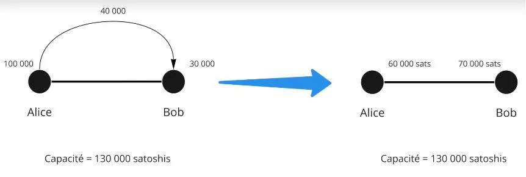
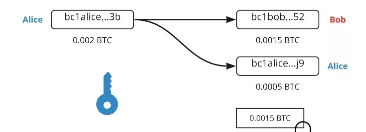
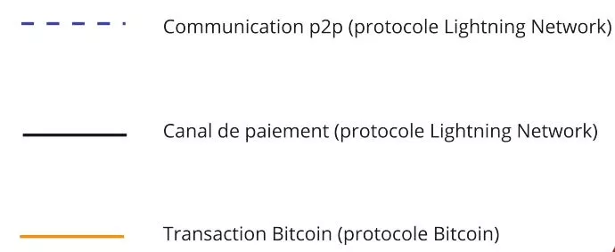
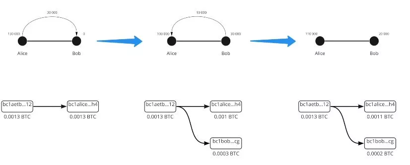
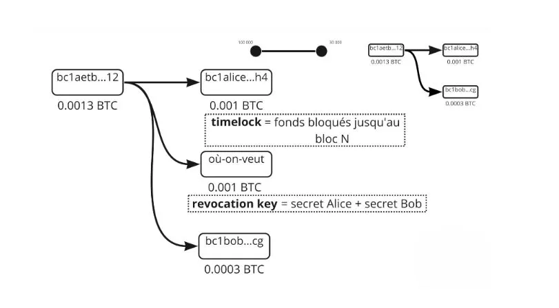
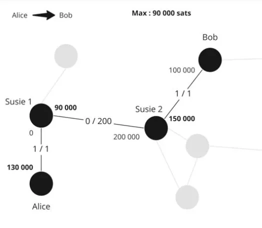
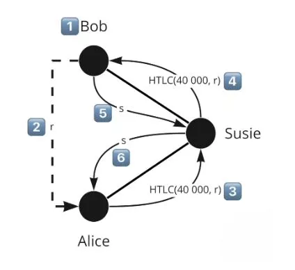
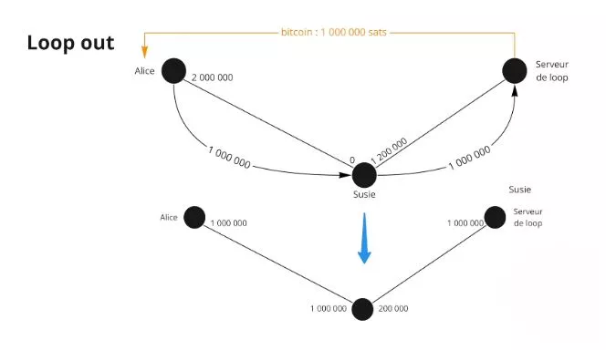
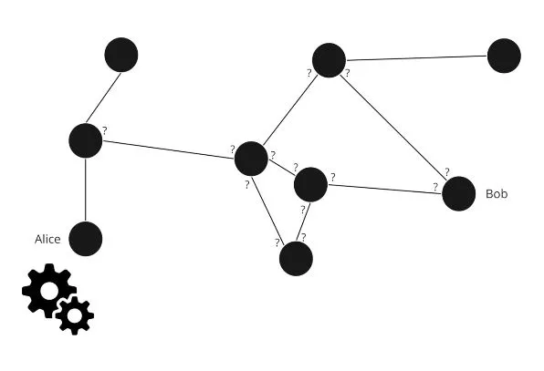

# Un voyage vers la seconde couche de Bitcoin

Cette formation est un cours théorique sur le fonctionnement technique du Lightning Network.

Bienvenue dans le monde passionnant du Lightning Network, une seconde couche de Bitcoin, qui une avancée technologique à la fois sophistiquée et riche de potentialités. Nous nous apprêtons à plonger dans les profondeurs techniques de cette technologie, sans nous concentrer sur des tutoriels ou des scénarios d'utilisation spécifiques. Pour tirer le meilleur parti de cette formation, une solide compréhension de Bitcoin est indispensable. C'est une expérience qui requiert une approche sérieuse et concentrée. Vous pouvez également envisager de suivre le cours LN 202 en parallèle, qui offre un aspect plus pratique à cette exploration. Préparez-vous à embarquer pour un voyage qui pourrait changer votre perception de l'écosystème Bitcoin.

Bonne découverte !

+++

# Les fondamentaux
<partId>32647d62-102b-509f-a3ba-ad1d6a4345f1</partId>

## Comprendre le Lightning Network
<chapterId>df6230ae-ff35-56ea-8651-8e65580730a8</chapterId>


Le réseau Lightning est une infrastructure de paiement de deuxième couche, construite sur le réseau Bitcoin, qui permet des transactions rapides et peu coûteuses. Pour comprendre pleinement comment fonctionne le réseau Lightning, il est essentiel de comprendre ce que sont les canaux de paiement et comment ils fonctionnent.

Un canal de paiement sur Lightning est une sorte de "voie privée" entre deux utilisateurs, qui permet des transactions Bitcoin rapides et répétitives. Lorsqu'un canal est ouvert, il est doté d'une capacité fixe, qui est définie à l'avance par les utilisateurs. Cette capacité représente le montant maximum de Bitcoin qui peut être transmis dans le canal à un moment donné.

Les canaux de paiement sont bidirectionnels, ce qui signifie qu'ils ont deux "côtés". Par exemple, si Alice et Bob ouvrent un canal de paiement, Alice peut envoyer du Bitcoin à Bob et Bob peut envoyer du Bitcoin à Alice. Les transactions à l'intérieur du canal ne modifient pas la capacité totale du canal, mais elles modifient la répartition de cette capacité entre Alice et Bob.


Pour qu'une transaction soit possible dans un canal de paiement Lightning, l'utilisateur qui envoie les fonds doit disposer de suffisamment de Bitcoin de son côté du canal. Si Alice souhaite envoyer 1 Bitcoin à Bob par le biais de leur canal, elle doit avoir au moins 1 Bitcoin de son côté du canal.

Limites et Fonctionnement des Canaux de Paiement sur Lightning

Bien que la capacité d'un canal de paiement Lightning soit fixe, cela ne limite pas le nombre total de transactions ni le volume total de Bitcoin qui peut être transmis à travers le canal. Par exemple, si Alice et Bob ont un canal avec une capacité de 1 Bitcoin, ils peuvent effectuer des centaines de transactions de 0,01 Bitcoin ou des milliers de transactions de 0,001 Bitcoin, tant que la capacité totale du canal n'est pas dépassée à un moment donné.

En dépit de ces limites, les canaux de paiement Lightning sont un moyen efficace d'effectuer des transactions Bitcoin rapides et peu coûteuses. Ils permettent aux utilisateurs d'envoyer et de recevoir des Bitcoin sans avoir à payer des frais de transaction élevés ou à attendre de longues périodes de confirmation sur le réseau Bitcoin.

En résumé, les canaux de paiement sur Lightning offrent une solution puissante pour ceux qui souhaitent effectuer des transactions Bitcoin rapides et peu coûteuses. Cependant, il est essentiel de comprendre leur fonctionnement et leurs limites pour pouvoir en tirer pleinement parti.



Exemple :

- Alice a 100 000 SAT
- Bob a 30 000 SAT

C’est donc l’état actuel du canal. Lors d’une transaction, Alice décide d’envoyer 40 000 SAT à Bob. Elle peut car 40 000 < 100 000.

Le nouvel état du canal est donc :

- Alice 60 000 SAT
- Bob 70 000 SAT

```
État initial du canal :
Alice (100,000 SAT) ============== Bob (30,000 SAT)

Après le transfert de Alice à Bob de 40,000 SAT :
Alice (60,000 SAT)  ============== Bob (70,000 SAT)

```


Désormais, Bob souhaite envoyer 80 000 SAT à Alice. N’ayant pas la liquidité, il ne peut pas. La capacité maximum du canal est de 130 000 SAT, avec une dépense possible jusqu'à 60 000 SAT pour Alice et de 70 000 SAT pour Bob.


## Bitcoin, adresses, UTXO et transactions
<chapterId>0cfb7e6b-96f0-508b-9210-90bc1e28649d</chapterId>


Dans ce second chapitre, nous prenons le temps d’étudier comment fonctionnent réellement les transactions Bitcoin, ce qui nous sera bien utile pour comprendre Lightning. Nous nous attardons aussi un instant sur la notion d’adresse multi-signature, qui est capitale pour comprendre le prochain chapitre consacré à l’ouverture de canaux sur le Lightning Network.

- Clé privée > Clé publique > Adresse : Lors d’une transaction, Alice envoie de l’argent à Bob. Ce dernier fournit une adresse donnée par sa clé publique. Alice qui a elle-même reçu l’argent sur une adresse via sa clé publique utilise désormais sa clé privée pour signer la transaction et ainsi débloquer les bitcoins de l’adresse.
- Lors d’une transaction, dans Bitcoin tous les bitcoins doivent bouger. Nommé UTXO (Unspend Transaction Output), les bouts de bitcoin vont tous partir quitte à retourner après chez le propriétaire même :

Alice a 0.002 BTC, Bob a 0 BTC Alice décide d’envoyer 0.0015 BTC à Bob. Elle va signer une transaction de 0.002 BTC où 0.0015 iront à Bob et 0.0005 retourneront dans son portefeuille.



Ici de une UTXO (Alice a 0.0002 BTC sur une adresse) nous avons donc créée 2 UTXO (Bob a 0.0015 et Alice a récupéré un nouvel UTXO (indépendent du précedent) de 0.0005 BTC).

```
Alice (0.002 BTC)
  |
  V
Transaction Bitcoin (0.002 BTC)
  |
  |----> Bob (0.0015 BTC)
  |
  V
Alice (nouvel UTXO: 0.0005 BTC)
```

Dans Lightning Network, on utilise des multi-signatures. Il faut donc 2 signatures pour débloquer les fonds, à savoir deux clé privées pour déplacer l’argent. Cela peut donc être Alice et Bob qui, ensemble, doivent accepter de débloquer l’argent (l’UTXO). Dans LN précisément, ce sont des transactions 2/2 donc il faut absolument les 2 signatures contrairement au multi-signatures 2/3 ou 3/5 où il faut seulement une combinaison du nombre complet de clés.


# Ouverture et fermeture des canaux
<partId>900b5b6b-ccd0-5b2f-9424-4b191d0e935d</partId>

## Ouverture de canal
<chapterId>96243eb0-f6b5-5b68-af1f-fffa0cc16bfe</chapterId>


À présent, nous nous penchons plus en détail sur l’ouverture de canal, et comment cette dernière est effectuée au travers d’une transaction Bitcoin.

Le Lightning Network a différents niveaux de communication :

- Communication p2p (protocole Lightning Network)
- Canal de paiement (protocole Lightning Network)
- Transaction Bitcoin (protocole Bitcoin)



Pour ouvrir un canal, les deux pairs parlent via un canal de communication :

- Alice : “Salut je veux ouvrir un canal !"
- Bob : "Ok, voici mon adresse publique.”


Alice a désormais 2 adresses publiques pour créer une adresse multi-sig 2/2. Elle peut maintenant faire une transaction bitcoin pour y envoyer de l’argent.

Considérons que Alice possède un UTXO de 0.002 BTC et qu'elle souhaite ouvrir un canal avec Bob de 0.0013 BTC.
Elle va donc créer une transaction avec 2 UTXO en sortie :

- un UTXO de 0.0013 vers l’adresse multi-sig 2/2
- un UTXO de 0.0007 vers une de ces adresses de change (retour des UTXO).

Cette transaction n’est pas encore publique car si elle l’est à ce stade, elle fait confiance à Bob pour pouvoir débloquer l’argent du multi-sig.

Mais alors comment faire ?

Alice va créer une deuxième transaction dite « transaction de retrait » avant de publier le dépôt des fonds dans le multi-sig.


La transaction de retrait va dépenser les fonds de l’adresse multi-sig vers une adresse à elle (ceci avant que tout soit publié).

Une fois les deux transactions construites, elle annonce à Bob que c’est fait et lui demande une signature avec sa clé publique en lui expliquant qu’ainsi, elle pourra récupérer ses fonds si quelque chose venait à mal se passer. Bob accepte car il n’est pas malhonnête.

Alice peut donc récupérer les fonds seule, elle a déjà la signature de Bob. Elle publie donc les transactions. Le canal est donc ouvert avec désormais 0.0013 BTC (130 000 SAT) du côté d’Alice.


## Transaction Lightning & d’engagement
<chapterId>7d3fd135-129d-5c5a-b306-d5f2f1e63340</chapterId>


Mainenant, analysons ce qui se passe réellement en coulisse lorsqu’on transfert des fonds d’un côté à l’autre d’un canal sur le Lightning Network, avec notamment la notion de transaction d’engagement. La transaction de retrait/fermeture on-chain représente l’état du canal, ceci garantit à qui appartient les fonds après chaque transfert. 

Donc après un transfert Lightning Network, il y a une mise à jour de cette transaction/contact non réalisé entre les deux pairs, Alice et Bob créent donc une même transaction avec l’état du canal actuel au cas où il a une fermeture :

- Alice crée un canal avec Bob avec 130 000 SAT de son côté. La transaction de retrait acceptée par les deux en cas de fermeture dit que 130 000 SAT iront chez Alice à la fermeture, Bob est d’accord car cela est juste.


- Alice envoie 30 000 SAT à Bob. Il y a donc une nouvelle transaction de retrait qui dit qu’en cas de fermeture, Alice touchera 100 000 SAT et Bob 30 000 SAT. Les deux sont d’accord car c’est juste.


- Alice envoie 10 000 SAT à Bob, une nouvelle transaction de retrait est à nouveau créée pour dire qu’Alice récupère 90 000 SAT et Bob 40 000 SAT. Les deux sont d’accord car c’est juste.



```
État initial du canal :
Alice (130,000 SAT) =============== Bob (0 SAT)

Après le premier transfert :
Alice (100,000 SAT) =============== Bob (30,000 SAT)

Après le deuxième transfert :
Alice (90,000 SAT) =============== Bob (40,000 SAT)

```
L’argent ne bouge donc jamais mais la balance finale s’actualise via une transaction signée mais non publiée on-chain. La transaction de retrait est donc une transaction d’engagement. Les transferts de satoshis sont une autre transaction d’engagement plus récente qui actualise la balance.

## Transactions d'engagement
<chapterId>f2f61e5b-badb-5947-9a81-7aa530b44e59</chapterId>


Si les transactions d’engagement dictent un état du canal avec la liquidité au moment X, peut-on tricher en publiant une ancienne et donc un ancien état ? La réponse est oui car on a déjà la pré signature des deux participants dans la transaction non publiée.


Pour résoudre ce problème on va rajouter de la complexité :

- Timelock = fonds bloqués jusqu’au bloc N
- Clé de révocation = secret Alice et secret Bob

C’est deux éléments sont rajoutés à la transaction d’engagement. Du coup, Alice doit forcément attendre la fin du Timelock, et toute personne qui détient la clé de révocation peut déplacer les fonds sans attendre la fin du Timelock. Si Alice essaie de tricher, Bob utilise la clé de révocation pour voler et punir Alice.



Désormais (et en réalité) la transaction d’engagement n’est pas la même pour Alice et Bob, ils sont symétriques mais chacun avec des contraintes différentes, ils se donnent mutuellement leur secret afin de créer la clé de révocation de la transaction d’engagement précédente. Donc à la création, Alice crée le canal avec Bob, 130 000 SAT de son coté, elle a un Timelock qui l’empêche de recouper immédiatement son argent, elle doit attendre un peu. La clé de révocation peut débloquer l’argent mais seul Alice l’a (transaction d’engagement d’Alice). Une fois qu’il y a un transfert, Alice va fournir son ancien secret à Bob et donc ce dernier pourra en cas de triche vider le canal à l’état précédent au cas ou Alice essaie de tricher (Alice est donc punie). 


De la même façon, Bob va fournir son secret à Alice. Pour que s’il essaie de tricher Alice puisse le punir. L’opération se répète à chaque nouvelle transaction d’engagement. Un nouveau secret est décidé et une nouvelle clé de révocation. Donc pour chaque nouvelle transaction, il faut détruire la transaction d’engagement précédente en donnant le secret de révocation. Ainsi si Alice ou Bob essaie de tricher, l’autre peut agir avant (grâce du Timelock) et donc éviter une triche. Lors de la transaction n°3, on donne donc le secret de la transaction n°2 pour permettre à Alice et Bob de pouvoir se défendre face à Alice ou Bob.


La personne qui crée la transaction avec le Timelock (celui qui envoie l’argent) peut utiliser la clé de révocation uniquement après le Timelock. Cependant la personne qui reçoit l’argent, peut l’utiliser avant le Timelock en cas de triche d‘un côté à l’autre d’un canal sur le Lightning Network. En particulier, nous passons en détail les mécanismes qui permettent de se prémunir d’une éventuelle tricherie de la part de son pair au sein du canal.

## Fermeture de canal
<chapterId>29a72223-2249-5400-96f0-3756b1629bc2</chapterId>


Nous nous intéressons à la fermeture de canal au travers d’une transaction Bitcoin, pouvant prendre différentes formes suivant les cas. Il existe 3 types de fermeture de canal :

- Le bon : fermeture coopérative
- La brute : fermeture forcée (non coopérative)
- Le truand : fermeture par un tricheur


### Le bon

Les deux pairs se parlent et acceptent de fermer le canal. Ils arrêtent donc toutes les transactions et valident un état final du canal. Ils se mettent d’accord sur les frais de réseaux (la personne qui ouvre le canal paie les frais de fermeture). Ils créent désormais la transaction de fermeture. Il y a donc une transaction de fermeture, différente des transactions d’engagement car il n’y a pas de Timelock et de clé de révocation. La transaction est donc publiée et Alice et Bob touchent leurs soldes respectifs. Ce type de fermeture est rapide (car pas de Timelock) et peu coûteuse en général.


### La brute

Alice veut fermer le canal, elle communique mais Bob ne répond car il est hors ligne (coupure internet ou électricité). Alice va donc publier la transaction d’engagement la plus récente (la dernière). La transaction est donc publiée et le Timelock s’active. Alors, les frais ont été décidé lors de la création de cette transaction il y a X temps dans le passé ! La MemPool est le réseau ayant changés depuis, le protocole utilise par défaut des frais 5 fois supérieurs à ceux actuels lors de la création de la transaction. Création frais à 10 SAT donc la transaction a considéré 50 SAT. Au moment de publier de façon forcée, la transaction de clôture le réseau est à :

- 1 SAT = surpayé par 50\*
- 100 SAT = sous payé par 2\*

Ceci rend donc la fermeture forcée plus longue (Timelock) et surtout plus hasardeuse ne terme de frais et donc possible validation par les mineurs.


### Le truand

Alice essaie de tricher en publiant une ancienne transaction d‘engagement. Mais Bob surveille la MemPool et guette s’il y a des transactions qui essaient d’en publier des anciennes. S’il en trouve, il utilise la clé de révocation pour punir Alice et prendre tous les SAT du canal.


Pour conclure, la fermeture de canal dans le Lightning Network est une étape cruciale qui peut prendre diverses formes. Dans une fermeture coopérative, les deux parties communiquent et s'accordent sur un état final du canal. C'est l'option la plus rapide et la moins coûteuse. En revanche, une fermeture forcée survient lorsque l'une des parties est non responsive. C'est une situation plus coûteuse et plus longue en raison des frais de transaction imprévisibles et de l'activation du Timelock. Enfin, si un participant tente de tricher en publiant une ancienne transaction d'engagement, le truand, il peut être puni en perdant tous les SAT du canal. Il est donc crucial de comprendre ces mécanismes pour une utilisation efficace et équitable du Lightning Network.

# Un réseau de liquidité
<partId>a873f1cb-751f-5f4a-9ed7-25092bfdef11</partId>

## Lightning le Réseau
<chapterId>45a7252c-fa4f-554b-b8bb-47449532918e</chapterId>


Dans ce septième chapitre, nous étudions le fonctionnement de Lightning en tant que réseau de canaux et comment des paiements sont acheminés de leur source vers leur destination.

Le Lightning est un réseau de canaux de paiement. Ce sont donc des milliers de pairs avec leurs canaux de liquidité qui sont connectés entre eux, et ainsi s’auto-utilisent pour réaliser des transactions entre pairs non-connecté.


La liquidité des canaux ne peut pas se déplacer dans d’autres canaux de liquidité.

`Alice -> Eden – > Bob`. Les satoshis n’ont pas bougé d’`Alice -> Bob`, mais d’`Alice -> Eden` et d’`Eden -> Bob`.

Chaque personne et canaux a donc de la liquidité différente. Afin de réaliser des paiements, il faut donc trouver une route dans le réseau avec assez de liquidité. S’il en manque, le paiement n’aboutira pas.

Soit le réseau suivant :

```
État initial du réseau :
Alice (130 SAT) ==== (0 SAT) Susie (90 SAT) ==== (200 SAT) Eden (150 SAT) ==== (100 SAT) Bob
```


Si Alice soit faire un transfert de 40 SAT à Bob alors la liquidité sera redistribuée le long de la route entre les deux parties.

```
Après le transfert de Alice à Bob de 40 SAT :
Alice (90 SAT) ==== (40 SAT) Susie (50 SAT) ==== (240 SAT) Eden (110 SAT) ==== (140 SAT) Bob
```


Toutefois, dans l'état initial, Bob ne peut pas envoyer 40 SAT à Alice car Susie n’a pas de liquidité avec Alice pour lui envoyer 40 SAT, donc le paiement n’est pas possible via cette route. Il faut donc une autre route où la transaction est impossible.

Dans le premier exemple, on remarque bien que Susie et Eden n’ont rien perdu et rien gagné. Pour accepter d’être utilisés pour router la transaction, les nœuds Lightning Network demandent des frais !

Il y a des frais différents en fonction d’où se trouve la liquidité

Alice – Bob

- Frais d’Alice = Alice -> Bob
- Frais de Bob = Bob -> Alice


Il y a deux types de frais :

- un frais fixe quel que soit le montant : 1 SAT (par défaut mais modifiable)
- un frais variable (0.01% par défaut)

Exemple de frais :

- Alice – Susie ; 1/1 (1 en frais fixe et 1 en frais variable)
- Susie – Eden ; 0/200
- Eden – Bob ; 1/1

Donc :

- Frais 1 : (payé par Alice a elle-même) 1 + (40 000/*0.000001)
- Frais 2 : 0 + 40 000 /* 0.0002 = 8 SAT
- Frais 3 : 1 + 40 000/* 0.000001 = 0.4 SAT



Envoi :

1. Envoi de 40 009.04 Alice -> Susie ; Alice paye a elle-même ses frais donc cela ne compte pas
2. Susie rend le service d’envoyer 40 001.04 à Eden, elle prend ça commission de 8 SAT
3. Eden rend le service d’envoyer 40 000 à Bob, il prend son 1.04 SAT de frais.

Alice a payé 9.04 SAT de frais et Bob a reçu 40 000 SAT.


Dans le LN, c’est donc le nœud d’Alice qui va décider de la route avant l’envoi. Il y a donc une recherche de la meilleure route et Alice est la seule qui connait la route et le prix. Le paiement est envoyé mais Susie n’a pas d’information.


Pour Susie ou Eden : ils ne savent pas qui est le destinataire final, ni celui qui envoie. Ceci est un routage en oignon. Le nœud doit donc garder un plan du réseau pour trouver sa route, mais aucun des intermédiaires n’a d’information.

## HTLC – Hashed Time Locked Contract
<chapterId>4369b85a-1365-55d8-99e1-509088210116</chapterId>


Dans un système de routage classique, comment s’assurer qu’Eden ne triche pas et respecte bien sa part du contrat ?

HTLC est donc un contact de paiement où l’on peut déverrouiller uniquement avec un secret. S’il n’est pas dévoilé, alors le contrat expire. C’est donc un paiement conditionnel. Comment sont-ils utilisés ?


Considérons la situation suivante
`Alice (100 000 SAT) ==== (30 000 SAT) Susie (250 000 SAT) ==== (0 SAT) Bob`

- Bob génère un secret S (la préimage) et en calcule le hash r= hash(s)
- Bob envoie une invoice à Alice avec notamment « r »
- Alice envoie un HTLC de 40 000 SAT à Susie avec pour condition de révéler « s’ » tel que hash(s’)=r
- Susie envoie un HTLC similaire à Bob
- Bob déverrouille le HTLC de Susie en lui montrant « s »
- Susie déverrouille le HTCL d’Alice en lui montrant « S »

Si Bob est hors ligne et ne relève jamais le secret qui lui donne la légitimité de recevoir l’argent, dans ce cas le HTLC va expirer après un certain nombre de bloc.



Les HTLC expirent dans l’ordre du dernier au premier : donc expiration Susie – Bob puis Alice – Susie.
Comme ça, si Bob revient, ça ne change rien. Dans le cas contraire, si Alice annule alors que Bob revient, ce sera le bordel et des gens peuvent avoir travaillé pour rien.

Bon et alors, la question c’est : en cas de clôture, il se passe quoi ? En fait, nos transactions d’engagement sont encore plus complexes. Il faut représenter la balance intermédiaire si jamais le canal se fait fermer.

Il y a donc un HTLC-out de 40 000 satoshis (avec les limitations vues avant) dans la transaction d’engagement via un output n°3.


Alice a donc dans la transaction d’engagement :

- Output n°1 : 60 000 SAT pour Alice via un Timelock et clé de révocation (ce qui lui reste)
- Output n°2 : 30 000 qui appartienne déjà à Susie
- Output n°3 : 40 000 en HTLC

La transaction d’engagement d’Alice est avec un HTCL-out car elle envoie à la destinatrice, Susie, un HTLC-in.


Donc si l’on publie cette transaction d’engagement, Susie peut récupérer l’argent du HTCL avec l’image « s ». Si elle n’a pas la préimage, Alice récupère l’argent une fois que le HTCL expire. Pensez les sorties (UTXO) comme différents paiements avec différentes conditions.
Une fois le paiement passé (expiration ou exécution), l’état du canal change et la transaction avec HTCL n’existe plus. On retourne avec quelque chose de classique.
En cas de fermeture coopérative : on arrête les paiements et donc on attend l’exécution des transferts/HTCL, la transaction est légère donc moins chère car il y a maximum 1 ou 2 outputs. 

Si fermeture forcée : on publie avec tous les HTLC en cours, ça devient donc très lourd et très coûteux. Et c’est le bordel.

En résumé, le système de routage du Lightning Network utilise des Hash Time-Locked Contracts (HTLC) pour assurer un paiement sécurisé et vérifiable. Les HTLC permettent de réaliser des paiements conditionnels où l'argent ne peut être déverrouillé qu'avec un secret, garantissant ainsi que les participants respectent leurs engagements.
Dans l'exemple présenté, Alice souhaite envoyer des SAT à Bob par l'intermédiaire de Susie. Bob génère un secret, crée un hash de celui-ci et le transmet à Alice. Alice et Susie mettent en place un HTLC basé sur ce hash. Une fois que Bob déverrouille le HTLC de Susie en lui montrant le secret, Susie peut alors déverrouiller le HTLC d'Alice.
Dans le cas où Bob ne révèle pas le secret dans un certain laps de temps, le HTLC expire. L'expiration se produit dans l'ordre du dernier au premier, assurant que si Bob revient en ligne, il n'y a pas de conséquences indésirables.

Lors de la clôture du canal, si c'est une clôture coopérative, les paiements sont interrompus et les HTLCs sont résolus, ce qui est généralement moins coûteux. Si la clôture est forcée, toutes les transactions HTLC en cours sont publiées, ce qui peut devenir très coûteux et désordonné.En somme, le mécanisme des HTLC ajoute une couche de sécurité supplémentaire dans le Lightning Network, assurant que les paiements sont exécutés correctement et que les utilisateurs respectent leurs engagements.

## Trouver sa voie
<chapterId>7e2ae959-c2a1-512e-b5d6-8fd962e819da</chapterId>


La seule donnée publique est la capacité totale du canal (Alice + Bob) mais on ne sait pas où se trouve la liquidité.
Pour avoir plus d’infos, notre nœud écoute le canal de communication du LN pour des annonces de nouveaux canaux et les mises à jour des frais des canaux. Votre nœud regarde aussi la blockchain pour la fermeture de canaux.

Comme nous n’avons pas toutes les informations, on doit faire une recherche de graph/route avec les informations qu’on a (capacité maximum des canaux et non où est la liquidité).

Critères :

- Probabilité de réussite
- Frais
- Délai d’expiration des HTLC
- Nombre de nœuds intermédiaires
- Aléatoire


Donc s’il y a 3 routes possibles :

- Alice > 1 > 2 > 5 > Bob
- Alice > 1 > 2 > 4 > 5 > Bob
- Alice 1 > 2 > 3 > Bob

On cherche donc la meilleure en théorie avec le moins de frais et le plus de chance de réussir : un maximum de liquidité et le moins de hop possible.

Si par exemple, 2-3 aillant que 130 000 SAT de capacité, envoyer 100 000 est très peu probable donc le choix n°3 a pu de chances de succès.


Désormais l’algorithme a fait ses 3 choix et va donc essayer le premier :

Choix 1 :

- Alice envoie un HTCL à 1 de 100 000 SAT ;
- Le 1 fait un HTLC de 100 000 SAT pour le 2
- Le 2 fait un HTLC de 100 000 SAT au 5 sauf que le 5 ne peut pas, donc l’annonce.

L’information est renvoyée donc Alice décide d’essayer la deuxième route :

- Alice envoie un HTLC de 100 000 à 1
- 1 fait un HTLC de 100 000 à 2
- 2 fait un HTLC de 100 000 vers 4
- 4 fait un HTLC de 100 000 vers Bob. Bob a la liquidité donc c’est ok.
- Bob utilise la préimage (hash) du HTLC et donc utilise le secret pour récupérer les 100 000 SAT
- 5 a donc désormais le secret du HTLC pour récupérer le HTLC bloqué de 4
- 4 a donc désormais le secret du HTLC pour récupérer le HTLC bloqué de 2
- 2 a donc désormais le secret du HTLC pour récupérer le HTLC bloqué de 1
- 1 a donc désormais le secret du HTLC pour récupérer le HTLC bloqué d’Alice

Alice n’a pas vu l’échec de la route 1, elle a juste attendu 1 seconde de plus. Un échec de paiement se déroule lorsqu’il n’y a pas de route possible. Pour faciliter la recherche de route, Bob peut fournir des infos à Alice pour aider dans son invoice :

- Le montant
- Son adresse
- Le hash de la préimage pour qu’Alice puisse créer le HTLC
- Des indications sur les canaux de Bob

Bob connait la liquidé des canaux 5 et 3 car il est directement connecté avec, il peut indiquer ça à Alice. Il prévient Alice que le nœud 3 est inutile, ça évite à Alice de potentiellement faire sa route.
Un autre élément serait les canaux privés (donc non publiés au réseaux) que Bob peut avoir. Si Bob a un canal privé avec 1, il peut dire à Alice de l’utiliser et ça donnerait Alice > 1 > Bob


En conclusion, le routage des transactions sur le Lightning Network est un processus complexe qui requiert la prise en compte de divers facteurs. Alors que la capacité totale des canaux est publique, la répartition précise de la liquidité n'est pas directement accessible. Cela oblige les nœuds à estimer les routes les plus probables de réussite, en tenant compte de critères tels que les frais, le délai d'expiration des HTLC, le nombre de nœuds intermédiaires et un facteur d'aléatoire.
Lorsque plusieurs routes sont possibles, les nœuds cherchent à minimiser les frais et à maximiser les chances de réussite en choisissant des canaux avec une liquidité suffisante et un nombre minimum de sauts. Si une tentative de transaction échoue en raison d'une liquidité insuffisante, une autre route est essayée jusqu'à ce qu'une transaction réussisse.

Par ailleurs, pour faciliter la recherche de route, le destinataire peut fournir des informations supplémentaires, comme l'adresse, le montant, le hash de la préimage, et des indications sur ses canaux. Cela peut aider à identifier les canaux avec une liquidité suffisante et éviter les tentatives de transactions inutiles.
En fin de compte, le système de routage du Lightning Network est conçu pour optimiser la vitesse, la sécurité et l'efficacité des transactions, tout en préservant la confidentialité des utilisateurs.

# Outils du lightning Network
<partId>74d6c334-ec5d-55d9-8598-f05694703bf6</partId>
## Invoice, LNURL, Keysend
<chapterId>e34c7ecd-2327-52e3-b61e-c837d9e5e8b0</chapterId>


Une facture LN (ou invoice) c’est long et pas agréable à lire, mais cela permet de représenter de manière dense une demande de paiement.

Exemple :
lnbc1m1pskuawzpp5qeuuva2txazy5g483tuv9pznn9ft8l5e49s5dndj2pqq0ptyn8msdqqcqzpgxqrrsssp5v4s00u579atm0em6eqm9nr7d0vr64z5j2sm5s33x3r9m4lgfdueq9qyyssqxkjzzgx5ef7ez3dks0laxayx4grrw7j22ppgzyhpydtv6hmc39skf9hjxn5yd3kvv7zpjdxd2s7crcnemh2fz26mnr6zu83w0a2fwxcqnvujl3

- lnbc1m = partie lisible
- 1 = séparation avec le reste
- Puis le reste
- Bc1 = Encodage Bech32 (base 32), on utilise donc 32 caractères.
- 10 = 1.2.3.4.5.6.7.8.9.0
- 26 = abcdefghijklmnopqrstuvwxyz
- 32 = pas le « b- i- o » et pas le « 1 »

### lnbc1m

- ln = Lightning
- Bc = bitcoin (mainnet)
- 1 = montant
- M = milli (10*-3 / u = micro 10*-6 / n = nano 10*-9 / p = pico 10*-12

Ici 1m = 1 /* 0.0001btc = 100 000 BTC

« Prié de payer 100 000 SAT sur le réseau Lightning du mainnet bitcoin à pskuawzpp5qeuuva2txazy5g483tuv9pznn9ft8l5e49s5dndj2pqq0ptyn8msdqqcqzpgxqrrsssp5v4s00u579atm0em6eqm9nr7d0vr64z5j2sm5s33x3r9m4lgfdueq9qyyssqxkjzzgx5ef7ez3dks0laxayx4grrw7j22ppgzyhpydtv6hmc39skf9hjxn5yd3kvv7zpjdxd2s7crcnemh2fz26mnr6zu83w0a2fwxcqnvujl3 »

### Timestamp (quand il a été créé)

Il contient 0 ou plusieurs parties supplémentaires :

- Hash de la préimage
- Secret de paiement (routage en oignon)
- Données arbitraires
- Clé publique LN du destinataire
- Durée d’expiration (par défaut 1h)
- Indications de routage
- Signature de l’ensemble

Il existe d’autres types d’invoice. Le meta-protocole LNURL permet de fournir un montant de satoshis direct au lieu de faire une demande. C’est très flexible et permet beaucoup d’améliorations en termes d’expérience utilisateur.


Un Keysend permet à Alice d’envoyer de l’argent à Bob sans avoir la demande de Bob. Alice récupère l’ID de Bob, crée une préimage sans demander à Bob et l’inclus dans son envoi. Donc, Bob va recevoir une demande surprise où il peut débloquer l’argent car Alice a déjà effectué le travail.


En conclusion, une facture Lightning Network, bien que complexe à première vue, encode de manière efficace une demande de paiement. Chaque section de l'invoice renferme des informations clés, incluant le montant à payer, le destinataire, le timestamp de création, et potentiellement d'autres informations comme le hash de la préimage, le secret de paiement, les indications de routage, et la durée d'expiration. Les protocoles tels que LNURL et Keysend offrent des améliorations significatives en termes de flexibilité et d'expérience utilisateur, permettant par exemple d'envoyer des fonds sans demande préalable de l'autre partie. Ces technologies rendent le processus de paiement plus fluide et plus efficace sur le Lightning Network.

## Gérer sa liquidité
<chapterId>cc76d0c4-d958-57f5-84bf-177e21393f48</chapterId>


Nous donnons quelques repères généraux pour répondre à la sempiternelle question de la gestion de la liquidité sur Lightning.


Dans LN, il y a 3 types de personnes :

- Les acheteurs : ils ont de la liquidé sortante, c’est le plus simple car il suffit d’ouvrir des canaux
- Les commerçants : c’est plus compliqué car ils ont besoin de liquidité entrante via d’autres nœuds et d’autre acteurs. Ils doivent avoir des gens connectés à eux
- Les nœuds de routage : ils veulent être équilibre avec de la liquidité des deux côtes et une bonne connexion à de nombreux nœuds pour être utilisés le plus possible

Donc si vous avez besoin de liquidité entrante, vous pouvez en acheter à des services.


Alice achète un canal avec Susie pour 1 million de satoshis donc elle ouvre un canal avec directement 1 000 000 SAT du coté entrant. Elle peut alors accepter jusqu’à 1 million de SAT de paiement par les clients qui seraient connectés avec Susie (qui est très connectée).

Une autre solution serait de faire des paiements ; vous payez 100 000 pour X raison, vous pouvez désormais recevoir 100 000.


### Solution Loop Out : Atomic swap LN – BTC

Alice 2 millions – Susie 0



Alice veut envoyer la liquidité vers Susie, donc elle fait un Loop out (un nœud spécial qui offre un service pro de rééquilibre LN/BTC).
Alice envoie 1 million à loop via le nœud de Susie, donc Susie a la liquidité et Loop renvoie la balance on-chain au nœud d’Alice.


Donc les 1 million partent chez Susie, cette dernière envoie 1 million à Loop, Loop envoie 1 million à Alice. Alice a donc déplacé la liquidité vers Susie au prix de quelques frais payés à Loop pour le service.

Le plus compliqué dans LN est de garder la liquidité.


En conclusion, la gestion de la liquidité sur le réseau Lightning Network est un enjeu clé, qui dépend du type d'utilisateur : acheteur, commerçant ou nœud de routage. Les acheteurs, ayant besoin de liquidité sortante, ont la tâche la plus simple : ils ouvrent simplement des canaux. Les commerçants, nécessitant une liquidité entrante, doivent être connectés à d'autres nœuds et acteurs. Les nœuds de routage, quant à eux, cherchent à maintenir un équilibre de liquidité des deux côtés. Plusieurs solutions existent pour gérer la liquidité, comme l'achat de canaux ou le paiement pour augmenter la capacité de réception. L'option "Loop Out", permettant un Atomic Swap entre LN et BTC, offre une solution intéressante pour rééquilibrer la liquidité. Malgré ces stratégies, maintenir la liquidité sur le réseau Lightning Network reste un défi complexe.

# Allez plus loin
<partId>6bbf107d-a224-5916-9f0c-2b4d30dd0b17</partId>

## Résumé de la formation
<chapterId>a65a571c-561b-5e1c-87bf-494644653c22</chapterId>


Notre objectif était d'expliquer comment le réseau Lightning fonctionne et comment il s'appuie sur Bitcoin pour fonctionner.

Le réseau Lightning est un réseau de canaux de paiement. Nous avons vu comment un canal de paiement fonctionne entre deux parties prenantes, mais nous avons également élargi notre vision à l'ensemble du réseau, à la notion de réseau de canaux de paiement.


Les canaux sont ouverts via une transaction Bitcoin et peuvent accueillir autant de transactions que possible. L'état du canal est représenté par une transaction d'engagement qui envoie à chacune des parties prenantes ce qu'elle possède de son côté du canal. Lorsqu'une transaction a lieu au sein du canal, les parties prenantes s'engagent sur le nouvel état en révoquant l'ancien état et en construisant une nouvelle transaction d'engagement.


Les paires se protègent de la tricherie avec des clés de révocation et un time lock. La fermeture mutuelle consentie est préférée pour fermer le canal. En cas de fermeture forcée, on publie la dernière transaction d'engagement.


Les paiements peuvent emprunter les canaux d'autres nœuds intermédiaires. Les paiements conditionnels sur l'acné (HTLC) permettent de bloquer les fonds en attendant la résolution complète du paiement. Le routage en oignon est utilisé dans Lightning Network. Les nœuds intermédiaires ne connaissent pas la destination finale des paiements. Alice doit calculer la route du paiement, mais n'a pas toutes les informations sur la liquidité dans les canaux intermédiaires.


Il y a une composante de probabilité lorsqu'on envoie un paiement via Lightning Network.




Pour recevoir des paiements, il faut gérer la liquidité dans les canaux, ce qui peut se faire en demandant à d'autres personnes d'ouvrir des canaux vers nous, en ouvrant soi-même des canaux et en utilisant des outils comme Loop ou en achetant/louant des canaux sur des marketplaces.


## Interview de Fanis
<chapterId>077cb5f5-1626-5da5-9964-e67b1de503bf</chapterId>


Voici un résumé de l'interview :

Le Lightning Network est une solution de paiement ultra-rapide sur Bitcoin qui permet de contourner les limitations liées à la scalabilité du réseau. Cependant, les bitcoins sur Lightning ne sont pas aussi sûrs que ceux sur la chaîne Bitcoin car la décentralisation et la sécurité sont privilégiées au détriment de la scalabilité.

L'augmentation excessive de la taille des blocs n'est pas une bonne solution car cela a des compromis en termes de nœuds et de capacité de données. Au lieu de cela, le Lightning Network permet de créer des canaux de paiement entre deux utilisateurs de Bitcoin sans faire apparaître les transactions sur la blockchain, économisant ainsi de la place sur les blocs et permettant à Bitcoin de scaler aujourd'hui.

Cependant, il y a des critiques concernant la scalabilité et la centralisation de Lightning Network, avec des problèmes potentiels liés à la fermeture des canaux et aux frais de transaction élevés. Pour résoudre ces problèmes, il est recommandé d'éviter d'ouvrir des petits canaux pour éviter les problèmes futurs et d'augmenter les frais de transaction avec Child Pay for Parent.

Des solutions envisagées pour l'avenir de Lightning Network sont le batching et la création de canaux en groupes pour réduire les frais de transaction, ainsi que l'augmentation de la taille des blocs à long terme. Cependant, il est important de noter que les bitcoins sur Lightning ne sont pas aussi sécurisés que les bitcoins sur la chaîne Bitcoin.

La confidentialité sur Bitcoin et Lightning sont liées, avec le routage en oignon garantissant un certain niveau de confidentialité pour les transactions. Cependant, sur Bitcoin, tout est transparent par défaut, avec des heuristiques utilisées pour traquer les Bitcoins d'adresse en adresse sur la chaîne Bitcoin.

Les achats de Bitcoins avec KYC permettent à l'exchange de connaître les transactions de retrait, tandis que les montants ronds et les adresses de change permettent de savoir quelle partie d'une transaction est destinée à une autre personne et quelle partie est destinée à soi-même.

Pour améliorer la confidentialité, les actions jointes et les coinjoins permettent de briser les calculs de probabilité en faisant des transactions où plusieurs personnes font une transaction ensemble. Les sociétés d'analyse de chaînes ont plus de mal à déterminer ce que tu fais de tes bitcoins en suivant.

Sur Lightning, il n'y a que deux personnes qui sont au courant de la transaction et c'est plus confidentiel que Bitcoin. Le routage en oignon signifie qu'un nœud intermédiaire ne connaît pas l'émetteur et le destinataire du paiement.

Pour utiliser Lightning Network, il est recommandé de suivre une formation sur ta chaîne YouTube ou directement sur le site découvre Bitcoin, ou d'utiliser la formation sur Umbrell. Il est également possible d'envoyer du texte arbitraire lors d'un paiement sur Lightning en utilisant un champ dédié pour cela, ce qui peut être utile pour des dons ou pour de la messagerie.

Cependant, il est important de noter que les nodes routage sur Lightning pourraient être régulés à l'avenir, avec certains États qui vont tenter de réguler les nodes routage.

Pour les marchands, il est nécessaire de gérer la liquidité pour accepter les paiements en Lightning Network, avec des contraintes actuelles qui peuvent être surmontées avec des solutions appropriées.

Enfin, le futur de Bitcoin est prometteur avec une projection possible d'un million en cinq ans. Pour assurer la professionnalisation de l'industrie et la création d'un système alternatif à celui du système bancaire existant, il est important de contribuer au réseau et d'arrêter de faire confiance.


## Donnez-nous votre avis sur ce cours
<chapterId>38814c99-eb7b-5772-af49-4386ee2ce9b0</chapterId>
<isCourseReview>true</isCourseReview>


## Remerciements et continuez à creuser le terrier du lapin
<chapterId>afc0d72b-4fbc-5893-90b2-e27fb519ad02</chapterId>

Félicitations ! 🎉

Vous avez terminé la formation LN 201 – Introduction au Lightning Network !
Vous pouvez être fier de vous car ce n’est pas facile. Sachez que peu sont les personnes qui descendent aussi bas dans le terrier du Bitcoin.

Tout d’abord, un grand merci à Fanis Makalakis pour nous avoir offert ce super cours gratuit sur un aspect plus ethnique du Lightning. N’hésitez pas à le suivre sur Twitter, sur son blog ou via son travail chez LN market.

Ensuite, si vous souhaitez aider le projet, n’hésitez pas à nous sponsoriser sur Patreon. Vos dons serviront à produire du contenus pour de nouvelles formations et bien évidemment, vous serez les premiers à être tenus au courant (y compris pour la prochaine de Fanis qui est dans les tuyaux !).

L’aventure Lightning Network continue avec la formation sur Umbrel et la mise en place d’un nœud Lightning Network. Fini la théorie et place à la pratique avec la formation LN 202 désormais !

Bisous et à très bientôt !

Rogzy
